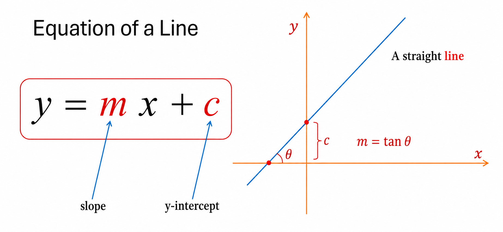
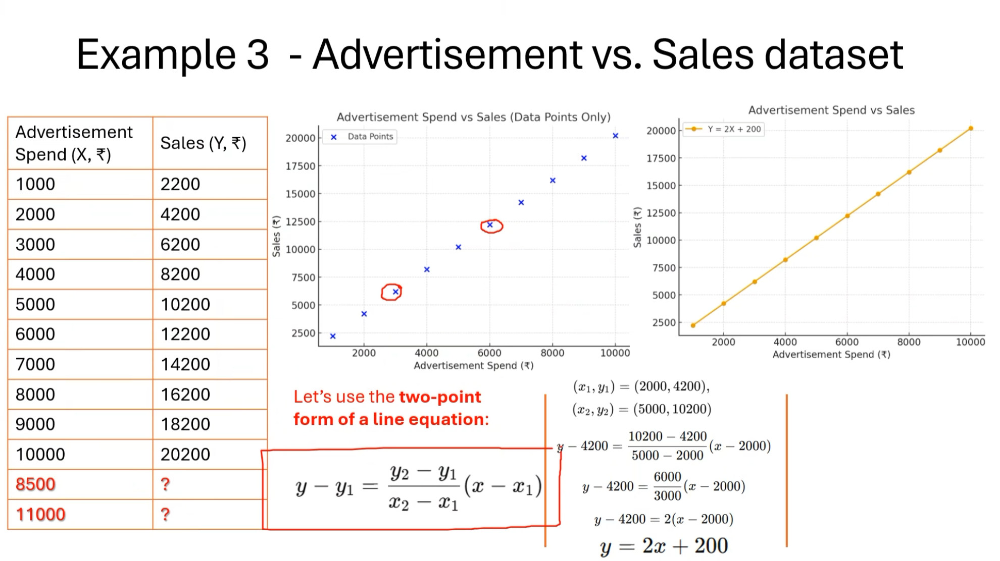
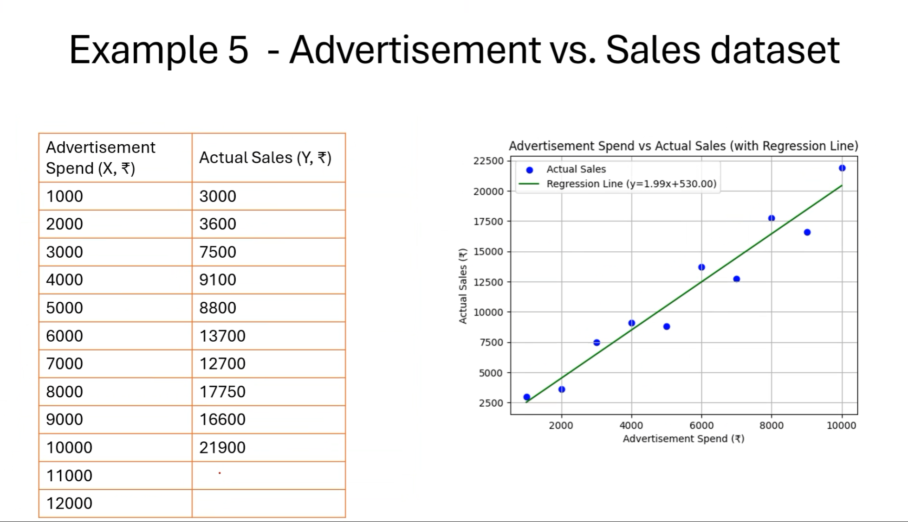
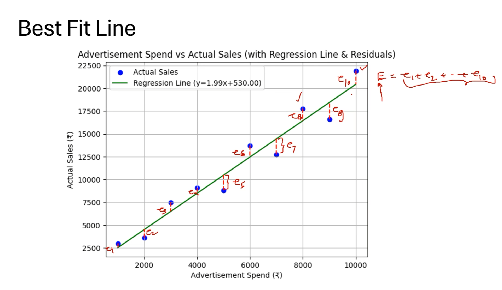
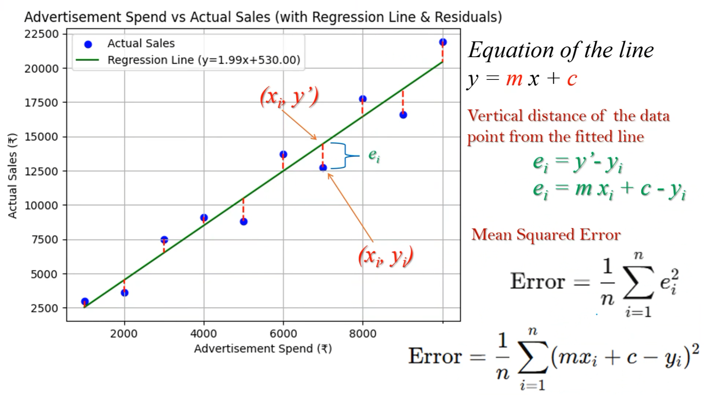
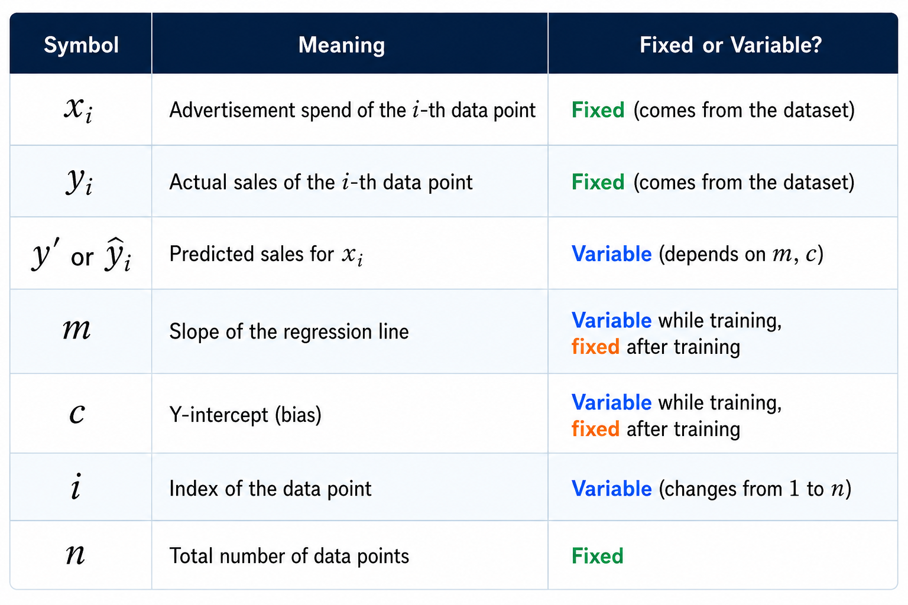
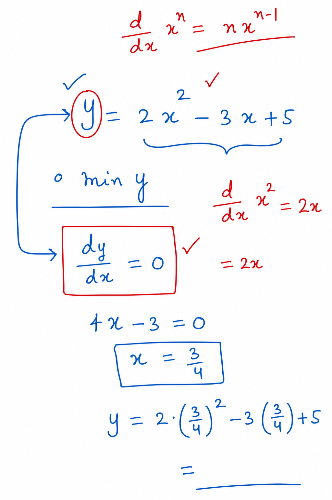
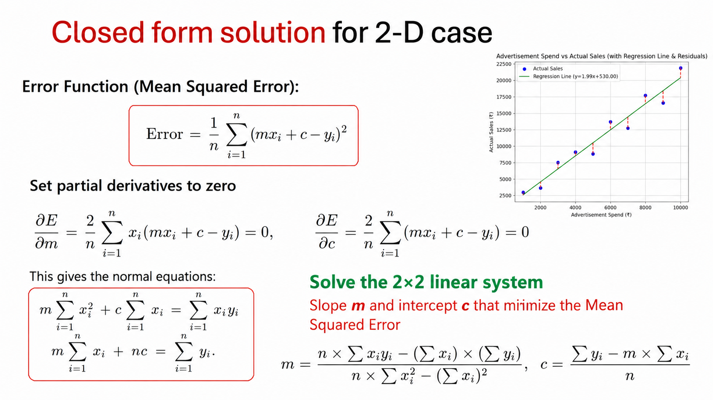

# Linear Regression

By Dr. Surya Prakash

<https://www.linkedin.com/in/dr-surya-prakash-5ba31121/>

Linear regression is a statistical method used to model the relationship between a dependent variable and one or more independent variables. It determines a "line of best fit" to predict continuous outcomes, commonly using the equation y = mx + b, where m is the slope and b is the intercept

---

## Introduction

### Steps

- collect the data
- observe the data
- find the relation

---

### how will we find the relation of x and y in linear regression?

- observe the data, maybe you will find
- if not then plot it, then find the relation

### if all the points aligned on a perfect line

- if we have 2 points then we can find the relation between them
- points are (x1, y1) & (x2, y2)

### if not aligned

- we need Best Fit Line
- to find that we need linear regression

### Compute Best Fit Line

- best fit line = the line from where the E is minimum
- e = distance of blue dot from the green line
- Error = E = sum of all distance

- mean of E = (e1 + e2 + e3 + .... + en) / n 
- so we can say the best fit line where mean of E is minimum

- xi - independent variable
- y' - dependent variable
- y' is the point on best fit line

compute the derivative of the Error

### How to find the minima of y if y = 2x^2 - 3x + 5

### compute the value of m & c 

---

### But what if point make parabola  chart .. what we  WILL do then?

- we need R^2
- higher the R^2 value = linear regression is good choice
- R^2 in range of 0.8 to 1.0 is best
- R^2 in range of 0 to 0.3 is very bad, reject the idea of applying linear regression
- range of R^2 is 0 to 1
