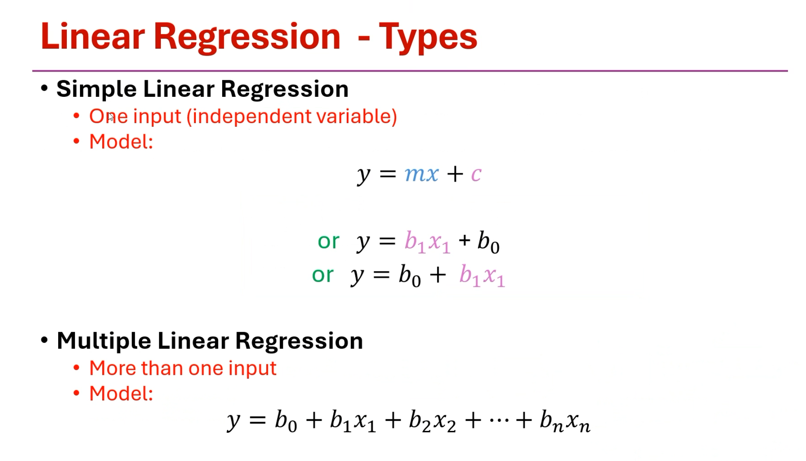
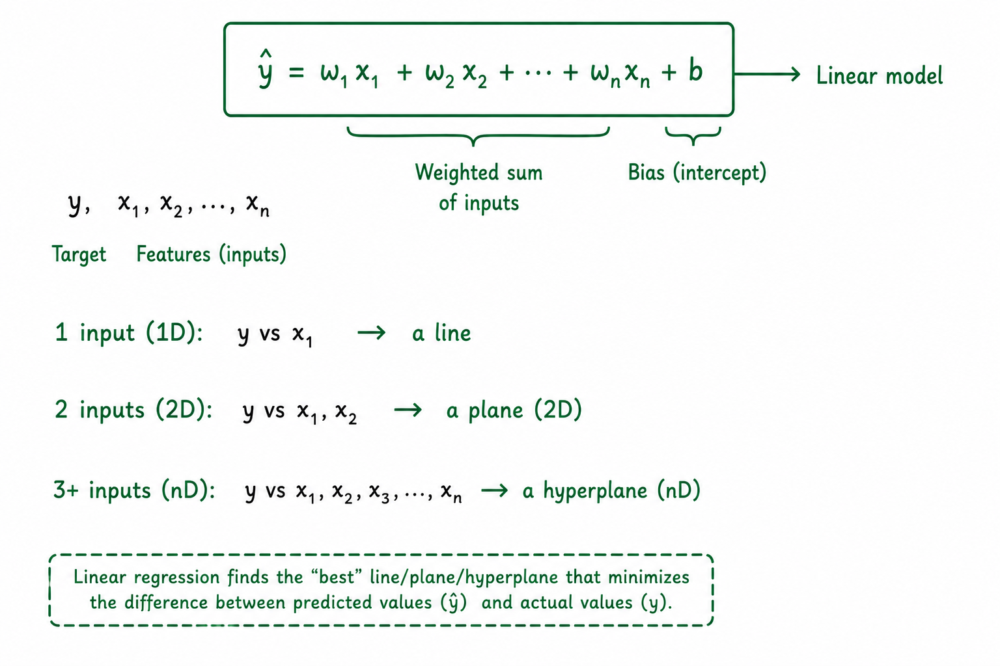
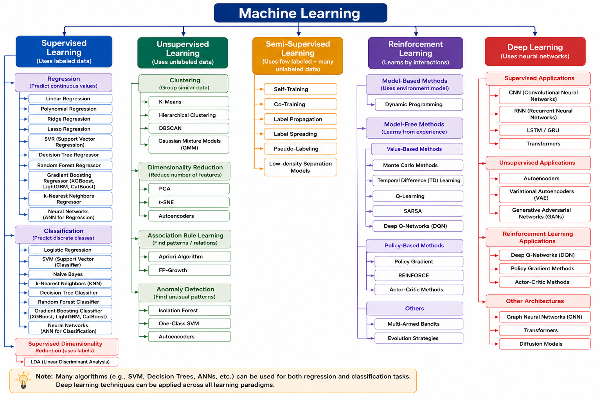

# Logistic Regression

By Dr. Surya Prakash

## Content

- Recap of Linear Regression
- Logistic Regression

---

## Recap of Linear Regression

### What do you mean by "Linear"?

"Linear" refers to being linear in the coefficients (the b's), not necessarily linear in the sense of "makes a straight line on a graph.

- highest power is 1
- power of variable is 1

### Variables

- input = independent variable
- output =  dependent variable

---

### Where we can use Regression? How to identify it's a Regression problem?

- Regression is used when you want to predict a continuous numeric value
- Example
  - Predicting house prices (₹25,00,000, ₹32,50,000, etc.)
  - Predicting temperature (23.5°C, 31.2°C)
  - Predicting a person's salary based on experience
  - Predicting stock prices
  - Predicting how many units will sell next month
  - Predicting someone's age from a photo

- Identify:
  - Is the output/target a number that can vary continuously?
  - The target variable (what you're predicting) is numeric
  - The output not fixed options
  - "How much?" or "How many?" or "What value?"

---

### Different Machine Learning Categories and Algorithms

---

## What is Logistic Regression?

Logistic Regression is a supervised machine learning algorithm used for classification, not regression (despite its name).

- Linear Regression → Solves Regression Problem
  - Continuous output

- Logistic Regression → Solves Classification Problem
  - Categorical output

> Input in both the cases can be continuous or categorical (discrete)

---

### Where we can use Classification? How we can we identify if the problem is a Classification problem?

- It is mainly used when the output (target variable) is binary
- example:
  - Will the amount be sanctioned?
  - Is the email spam or not spam?
  - Will the student pass or fail?

- two categorical output (true/false), (yes/no)
- more than two (amazon product rating), (blood group)
- when outputs are can be many but limited
- Face recognition could be n number of possibility but n != infinite

### Why its call Logistic regression, should say Logistic Classifier/Classification?

- there is no reason, just remember Logistic is not a Regression, it is Classification

---
---

### Logistic Regression method

- out put of Logistic Regression is Probability
- Probability P = 1/1+e^-z

Likelihood = L = (1-p1)(1-p2)(1-p3)p4 p5 p6

Best fit curve = if L is maximum

log base e = ln

l = log of L

MLE = Maximum log likelihood estimate